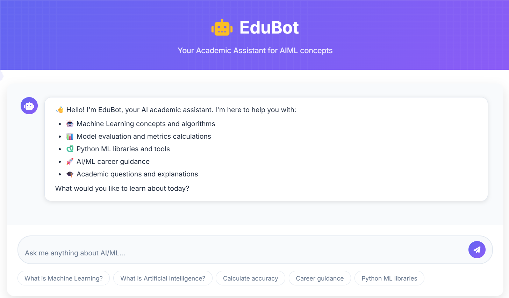
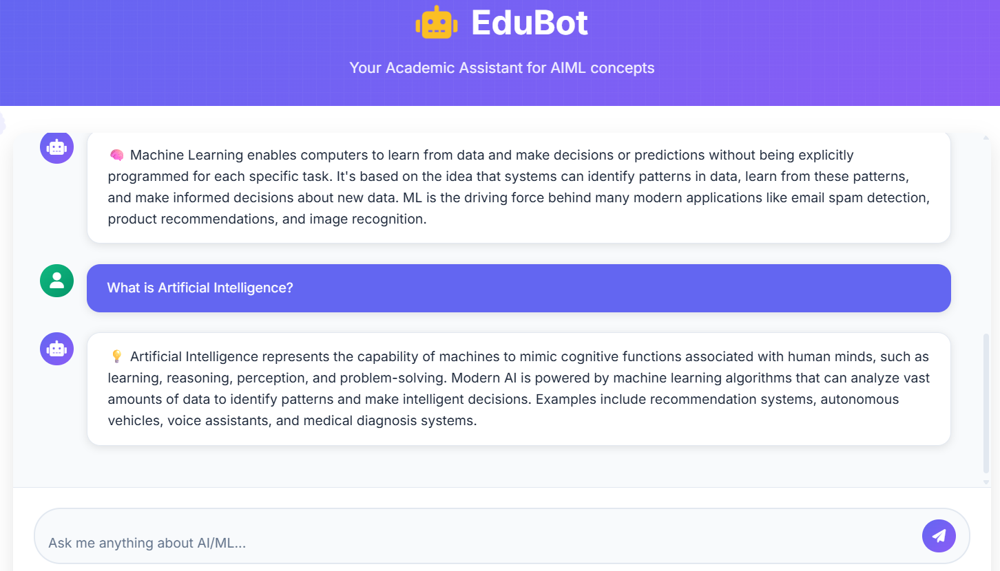

# 🤖 EduBot - AI Academic Assistant

EduBot is a cutting-edge, interactive chatbot designed to help students understand and master AI and Machine Learning concepts. Built with Flask, TensorFlow, and a modern, responsive UI, EduBot provides real-time assistance, educational guidance, and interactive calculations—all in one sleek interface.

---

## 🚀 Features
- **Smart AI Assistant:** Answers questions about ML/AI concepts using trained models  
- **Interactive Calculations:** Performs accuracy, precision, recall, and F1-score calculations  
- **Modern UI:** Beautiful, responsive chat interface with smooth animations  
- **Real-time Chat:** Instant responses with typing indicators for a realistic conversation feel  
- **Conversation Logging:** Saves chat history to improve responses over time  
- **Career Guidance:** Provides AI/ML career advice, roadmap tips, and learning resources  
- **Customizable Intents:** Easily add new topics and responses by updating `intents.json`  
---

## 🛠️ Tech Stack
- **Backend:** Python, Flask  
- **AI/ML:** TensorFlow, Keras, Scikit-learn  
- **Frontend:** HTML, CSS (modern responsive design)  
- **Data:** JSON for intents, HDF5 for model storage  
---

## 📂 Folder Structure
```text
EDUBOT
│
├── model
│ ├── chatbot_model.h5
│ └── metadata.pkl
│
├── static
│ └── style.css
│
├── templates
│ └── index.html
│
├── app.py
├── intents.json
├── README.md
├── requirements.txt
└── train_model.py
```
---



---


---

<p align="center"> ✨ Maintained by <a href="https://github.com/yashhavalannache">Yash Havalannache</a> ✨ </p> 